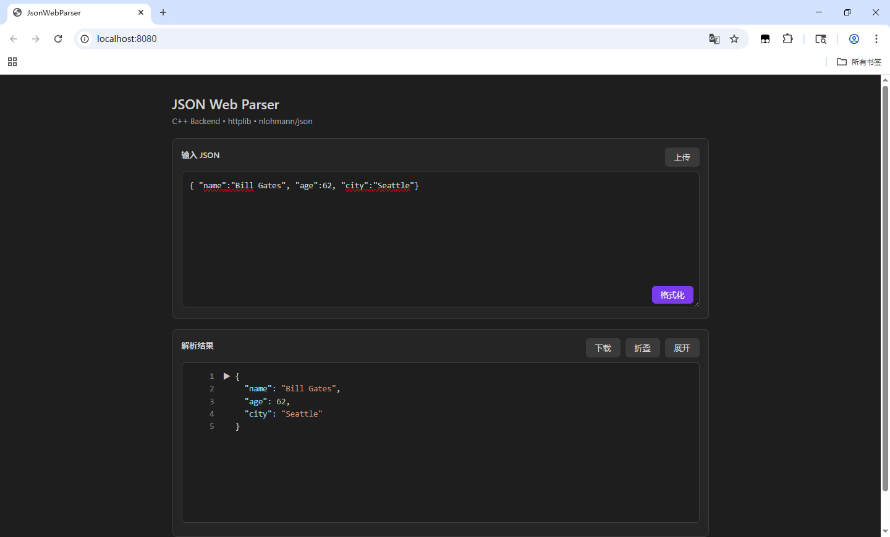
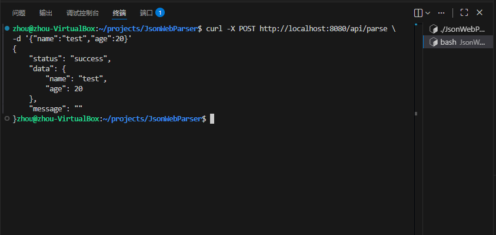
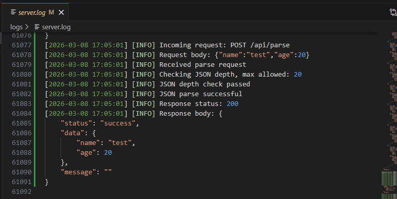

# JSON Web Parser

A lightweight HTTP JSON parsing service written in C++.

- C++17
- cpp-httplib
- nlohmann/json
- Linux

# JSON Web Parser

一个基于 **C++17** 开发的轻量级 HTTP 后端服务，用于在线解析和格式化 JSON 数据。  
用户可以通过浏览器或 HTTP 请求提交 JSON，服务器会返回格式化后的结果或错误信息。

该项目主要用于学习 **C++ 后端开发、HTTP 服务、JSON 解析以及基本工程化结构设计**。

---


# 项目截图

## Web 页面



示例页面用于输入 JSON 数据并展示格式化后的结果。

## API 请求示例



通过浏览器或 curl 发送 HTTP 请求到服务器进行 JSON 解析。

## 返回结果示例



服务器返回统一格式的 JSON 响应。


---

# 项目特点

- 使用 **C++17** 开发
- 基于 **HTTP Server** 实现 JSON 解析接口
- 使用 **nlohmann/json** 实现 JSON 解析和格式化
- 使用 **cpp-httplib** 实现轻量级 Web 服务
- 采用 **分层架构设计（Controller / Service / Utils）**
- 实现 **线程安全日志系统**
- 支持 **多线程并发请求处理（Thread Pool）**
- 在 **Linux 环境** 下开发和运行

---

# 项目目录结构

```
jsonwebparser/
├── build/                # 构建目录
├── logs/                 # 日志输出目录
├── src/
│   ├── config/           # 配置模块
│   ├── controller/       # 控制层（HTTP 请求处理）
│   ├── middleware/       # 中间件（日志等）
│   ├── model/            # 数据模型
│   ├── server/           # HTTP Server 实现
│   ├── service/          # 业务逻辑
│   ├── utils/            # 工具类（日志、响应封装等）
│   └── main.cpp          # 程序入口
│
├── static/               # 前端静态页面
├── third_party/          # 第三方库
├── CMakeLists.txt        # CMake 构建脚本
├── Description           # 项目说明
└── README.md             # 项目文档
```

这种结构能够降低模块之间的耦合，提高代码的可维护性和可扩展性。

---

# API 设计

## 解析 JSON

```
POST /api/parse
```

### 请求示例

```json
{
  "name": "test",
  "age": 20
}
```

### 成功返回

```json
{
  "status": "success",
  "data": {
    "name": "test",
    "age": 20
  }
}
```

### 错误返回

```json
{
  "status": "error",
  "message": "Invalid JSON format"
}
```

---

# 运行环境

- Linux / macOS
- C++17
- g++
- CMake

---

# 依赖库

- cpp-httplib：用于实现 HTTP Server  
- nlohmann/json：用于 JSON 解析与格式化  

这两个库都是 **header-only library**，无需额外安装。

---

# 编译与运行

## 1. 克隆项目

```bash
git clone https://github.com/ivrdpkwn/JsonWebParser.git
cd jsonwebparser
```

## 2. 编译

```bash
mkdir build
cd build
cmake ..
make
```

## 3. 运行

```bash
cd build
cd bin
./jsonwebparser
```

服务器默认运行在：

```
http://localhost:8080
```

---

# 测试接口

可以使用 curl 测试：

```bash
curl -X POST http://localhost:8080/api/parse -d '{"name":"test","age":20}'
```

---

# 日志系统

服务器实现了简单日志系统：

- 支持 INFO / ERROR 日志级别
- 支持输出到控制台
- 支持写入日志文件
- 使用 mutex 保证多线程环境下日志安全

日志示例：

```
[INFO] Request received: POST /api/parse
[ERROR] JSON parse error
```

---

# 并发处理

服务器使用 **cpp-httplib 内置 Thread Pool** 处理并发请求。

优势：

- 避免频繁创建和销毁线程
- 提高服务器吞吐能力
- 支持多个客户端同时访问

---


# 项目目的

该项目主要用于练习：

- C++ 后端开发
- HTTP 服务实现
- JSON 数据处理
- 基本服务器架构设计
- Linux 下 C++ 项目开发流程
